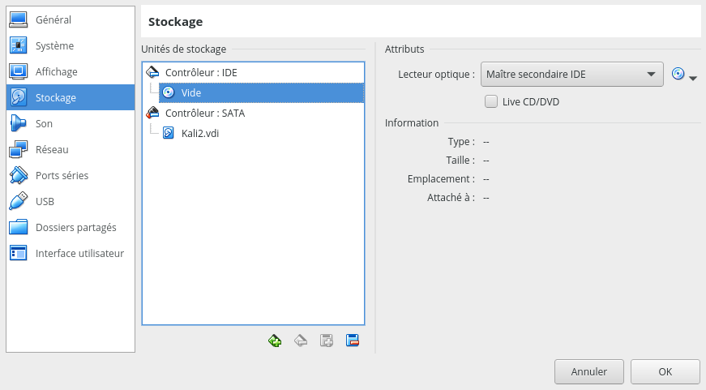
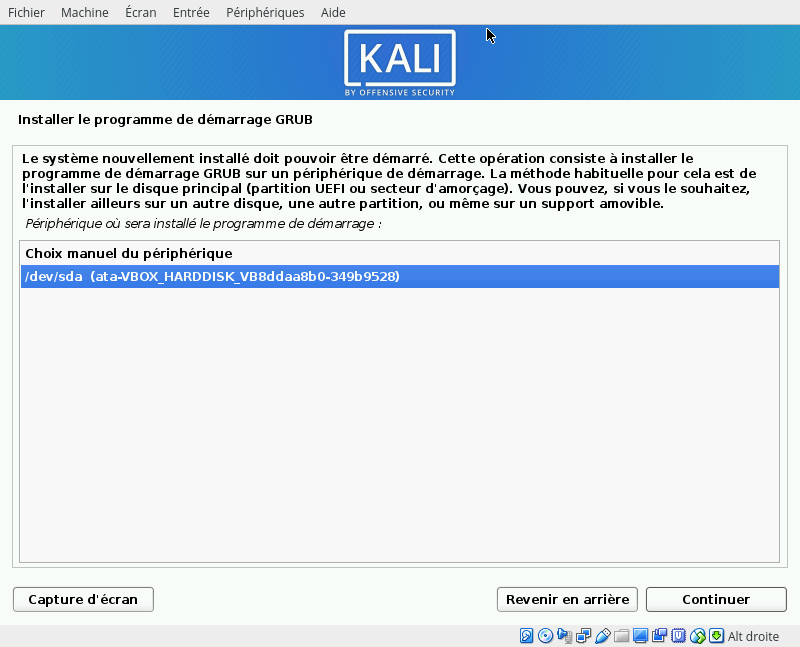
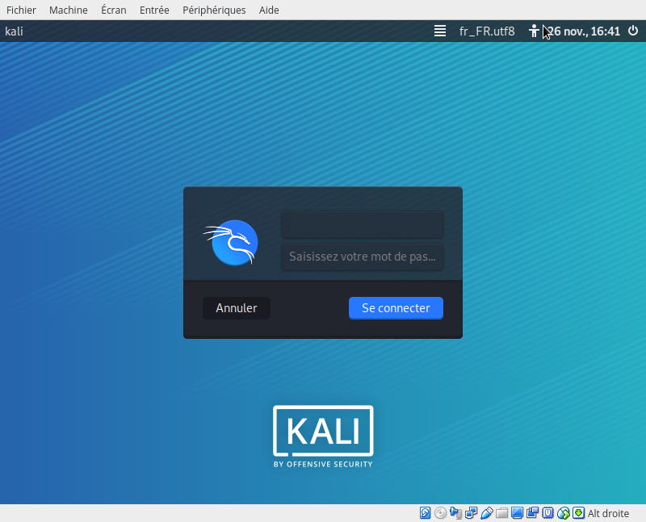
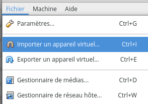
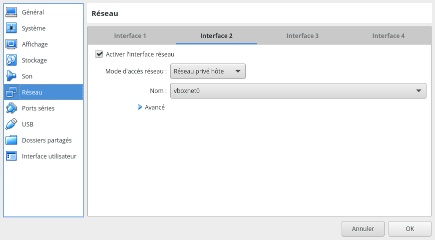
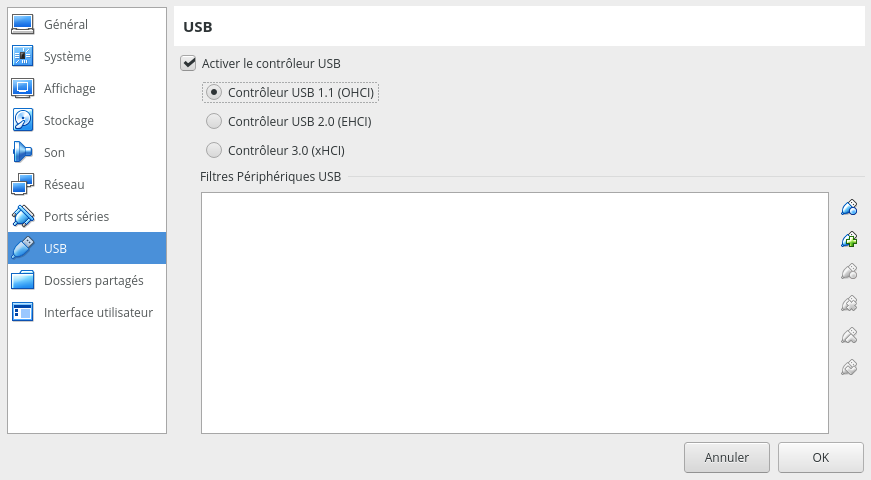

---
title: "Mise en place d'un lab avec Kali Linux et Metasploitable 2"
author: [Olivier LASNE]
date: "2020-11-25"
subject: "Markdown"
keywords: [VirtualBox, Linux, installation]
subtitle: "Guide d'installation dans VirtualBox"
lang: "fr"
titlepage: true
...

## Télécharger les fichiers

### Introduction
Ce document décrit comment intaller Kali Linux et Metesploitable 2 dans Virtualbox. On va configurer un *réseau privé hôte* pour que les deux puissent communiquer.

### Installer Virtualbox

VirtualBox est un logiciel de virtualisation qui va nous permettre d'utiliser Kali Linux dans un environnement isolé, et sans avoir besoin d'un second ordinateur.

Télécharger la version de **Virtualbox** adaptée à votre système d'exploitation (probablement Windows) à l'addresse suivante :
**[https://www.virtualbox.org/wiki/Downloads](https://www.virtualbox.org/wiki/Downloads)**

L'installer de façon classique en double-cliquant sur le **.exe** et en laissant les **options par défaut** à chaque étape.

### Téléchargement de Kali en fichier .iso

Les fichiers **.iso** sont des fichiers qui imitent un CD. Ce sera ici comme si on utilisait un CD d'installation. Télécharger **Kali Linux 64-Bit (Installer)** à l'adresse suivante :
**[https://www.kali.org/downloads/](https://www.kali.org/downloads/)**

### Téléchargement de Metasploitable 2

**Metasploitable 2** est une machine virtuelle volontairement vulnérable. Vous pouvez la télécharger à l'adresse suivante. 
**[https://drive.google.com/drive/folders/1O2U2h_swKD95okCpEqydXKbhNf8R3ttr?usp=sharing](https://drive.google.com/drive/folders/1O2U2h_swKD95okCpEqydXKbhNf8R3ttr?usp=sharing)**

1. Double cliquer sur le fichier
2. Cliquer sur Télécharger
3. Accepter malgré l'absence d'analyse antivirus

\newpage

## Installer Kali

### Configuration VirtualBox
Cliquer sur le bouton **Nouvelle**. 

Donner un nom (ex: Kali), puis choisir type **Linux** et version **debian64**.


Dans l'option **Taille de mémoire** selectionner **2048**.

Laisser les options par défaut, et à **Emplacement du fichier et taille** choisir **80,00 Gio**.


Ensuite cliquer sur l'icone Configuration. 

Selectionner **Stockage > *Vide* sous Contrôleur IDE**.



Cliquer sur l'icone de CD {height=20}, et **Choissisez un fichier de disque optique virtuel**. Et selectionner le fichier *kali-linux-2020.4-installer-amd64.iso* téléchagé précédement.

Appuyer sur **OK** en bas à droite pour confirmer les modifications. 

On peut mantenant lancer la machine virtuelle avec le bouton **Démarrer**. .

### Installation de Kali

Au démarrage selectionner **Graphical Install**.

On peut ensuite selectionner **french - français** pour la langue, puis laisser les options par défaut.

Pour le **nom de la machine**, vous pouvez laisser **kali**.

Définisez un **nom d'utilisateur** comme votre prénom ou pseudo, et un mot de passe de votre choix.

Laissez ensuite les options par défaut pour le disque. Et indiquez **Oui** à la page **partitionner les disques**.


Patientez pendant l'installation. Vous pouvez laisser les paramètre par défaut concernant le choix de logiciels. (L'installation prend environ 1h.)

Pour l'emplacement de **Grub** choisir **/dev/sda**.\
**/!\\ Attention, si vous laisser le choix par défaut à cette étape. La machine démarrera avec un écran noir**



Cliquez ensuite sur **continer** en laissant ensuite les choix par défaut, et le champ texte vide.

Une fois l'**installation terminée**, vous cliquer sur **continuer** pour redémarrer.\
Ensuite vous pouvez vous **connecter** à Kali avec votre **identifiant et mot de passe**.



### Permettre le redimensionnement

Par défaut, la taille de l'écran de la machine ne s'adapte pas à celle de la fenêtre de VirtualBox. Il est nécessaire d'installer les **guest-additions** dans Kali pour que ce soit le cas.

Pour les installer, ouvrir un terminal et écrire les commandes suivante :
```sh
sudo apt install virtualbox-guest-dkms
sudo dpkg-reconfigure virtualbox-guest-dkms
```
Puis redémarrer.

Lorsque le noyau Linux est mis à jour, cela à tendance à casser la configuration.\
Si l'écran ne se redimensionne plus, il est alors nécessaire de refaire la commande **`sudo dpkg-reconfigure virtualbox-guest-dkms`**, et de redémarrer la machine virtuelle.


\newpage

## Importer Metasploitable

Metasploitable 2 vient ici sous la forme d'une machine virtuelle déjà configurée. Il n'est ici pas nécessaire de réaliser l'installation, on va juste importer le fichier *metasploitable2.ova*.

Dans VirtualBox, utiliser la fonction **Fichier > Importer un appareil virtuel**.

{height=200}

Cliquer si l'icone de dossier , et selectionner le fichier *metasploitable2.ova* (dans téléchargement). 

Enusite cliquer sur **suivant** puis **importer**.

\newpage

## Configuration du réseau hôte

### Créer le réseau privé hôte
Un **réseau privée hôte** est un réseau virtuel, qui connecte des machines virtuelles et qui est accessible **uniquement aux machines virtuelles de VirtualBox**, et à la machine faisant tourner VirtualBox.

Après avoir ouvert **VirtualBox**, cliquer sur **Ficher > Gestionnaire de réseau hôte**.
Normalement la configuration suivante est affichée : 


Si il n'y a pas d'interface réseau. Cliquer sur **Créer**, pour créer une nouvelle interface vboxnet0.


## Configurer les interfaces de Kali
Pour **Kali** on garde une interface en **NAT** de façon à pouvoir accéder à Internet, et on créer une **seconde interface** pour le **réseau privé hôte**.


1. Éteindre la machine virutelle Kali.
2. Sélectionner la machine virtuelle dans VirtualBox.
3. Appuyer sur le **bouton configuration** (icone en forme d'engrenage)
4. Dans la barre à gauche cliquer sur **Réseau**
5. Cliquer sur *Interface 2* 
6. Cocher *activer l'interface réseau*.
7. Dans **mode d'accès réseau**, selectionner **Réseau privé hôte**.
8. Dans **nom**, selectionner **vboxnet0**



Normalement, nous devrions avoir maintenant deux **interfaces réseau configurées** :

* Une **interface 1** en **NAT**
* Une **interface 2** en **réseau privé hôte**.

## Configurer les interfaces de Metaspoiltable
Faire la même chose sur **Metasploitable**.\
Configurer l'interface réseau 1, et définir le **réseau privé hôte** *vboxnet0*. (Il n'est pas nécessaire de garder une interface en NAT pour accèder à Internet.)


Nous devrions maintenant avoir une seule interface :

* **Interface 1** en **réseau privé hôte**

\newpage

## Erreurs communes VirtualBox

### Erreur USB au démarrage
Il est fréquent qu'une machine virtuelle n'arrive pas à démarrer cause d'une configuration du contrôleur USB.

{height=500}

Dans ce cas, changer le contrôleur dans les paramètres USB de la machine virtuelle.

1. Cliquer une fois sur la machine virtuelle.
2. Appuyer sur le **bouton configuration** (icone en forme d'engrenage)
3. Dans la barre à gauche cliquer sur **USB**
4. Selectionner **Contrôleur USB 1.1 (OHCI)**


