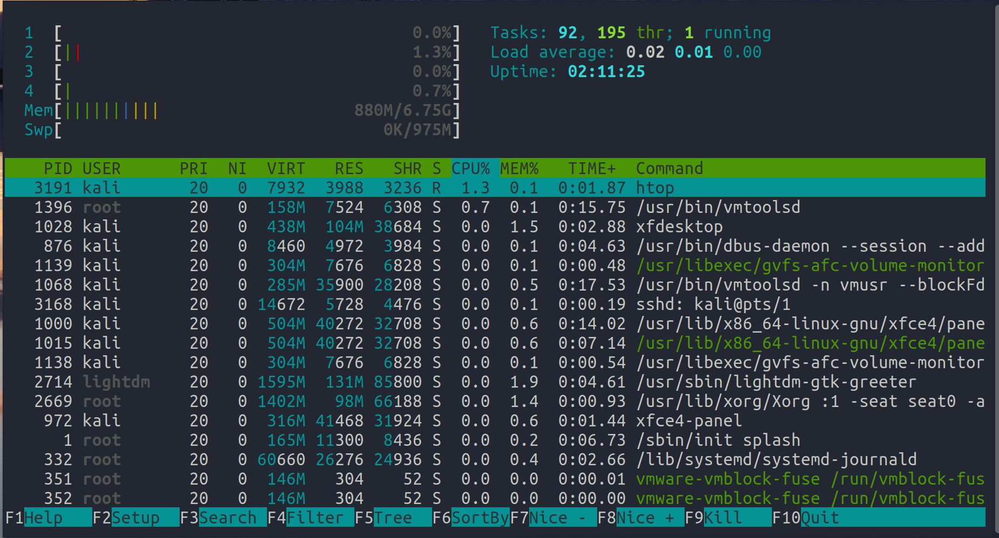

---
title: "TP administration de Linux"
author: [Olivier LASNE]
date: "2020-11-26"
subject: "Linux"
keywords: [Linux, bash, ligne de commande, shell, administration]
subtitle: "Administration d'un système Linux à travers un shell"
lang: "fr"
titlepage: true
...

# Administration de Linux

## Introduction

Le but de ce TP est de vous mettre à l'aise avec l'administration d'un système Linux à travers la ligne de commande.
Nous y verrons à la fois des commandes d'administrations, des commandes puissantes.

## Linux, et les fichiers

Sous Linux, il est coutume de dire de "Tout est fichier". À peut près tout est représenté sous la forme d'un fichier.\
Les disques durs de l'ordinateur sont représentés par les fichiers `/dev/sda`, `/dev/sdb`, etc. Les processus de l'ordinateurs sont représentés dans `/proc/`. Les paramtères du noyau sont représentés par `/sys/kernel/`.

Un exemple de cela, est que l'on peut ouvrir une connexion TCP en ouvrant un fichier. Par exemple `/dev/tcp/10.0.0.1/8080` pour la machine `10.0.0.1` sur le port `8080`.

Nous ne rentrerons pas ici dans les détails, retenez juste que l'on peut configurer et accéder à presque tout à travers des fichiers.

Riche de cette culture, Linux va utiliser des fichiers pour représenter la plupart des paramètres de configuration.

## Lister les processus

On utilise la commande **ps** pour lister les processus. On peut lister l'ensemble des processus avec **`ps aux`**.

```sh
$ sudo ps aux
USER         PID %CPU %MEM  STAT START   TIME COMMAND
root           1  0.1  0.1  Ss   13:47   0:06 /sbin/init splash
root           2  0.0  0.0  S    13:47   0:00 [kthreadd]
root           3  0.0  0.0  I<   13:47   0:00 [rcu_gp]
root           4  0.0  0.0  I<   13:47   0:00 [rcu_par_gp]
root           6  0.0  0.0  I<   13:47   0:00 [kworker/0:0H-kblockd]
root           8  0.0  0.0  I<   13:47   0:00 [mm_percpu_wq]
root           9  0.0  0.0  S    13:47   0:00 [ksoftirqd/0]
...
```

Le **PID** (Process ID) est l'identifiant unique de chaque **processus**.

**Exercice :**

1. Lancer `cmatrix` dans un terminal.
2. Ouvrir un second terminal, et utiliser `ps aux | grep cmatrix` pour obtenir le **PID** de **cmatrix**.

### Tuer un processus

On peut tuer un processus avec la commande **kill** et son **PID**.
Par exemple, pour un processus dont le PID serait *2843*. On peut utiliser la commande suivante:
```sh
$ kill 2843
```

`kill` sans option demande au processus de s'arrêter "proprement". Si jamais le processus ne répond pas on peut utiliser `kill -9` pour forcer l'arrêt du processus.

```sh
$ kill -9 2843
```
**Exercice :**

1. Lancer `cmatrix` dans un terminal.
2. Ouvrir un second terminal, trouver le **PID** de `cmatrix` puis tuer le avec **kill**.

### Htop

On peut voir une **liste dynamique** des processus avec la commande **top**.

Pour voir gérer l'ensemble des processus, un programme très pratique est **htop**. Il est nécessaire de l'installer avec `sudo apt install htop`.



On peut utiliser **F5** pour affichier les processus sous forme d'arbre.

**Exercice:**

1. Lancer **Firefox**
2. Utiliser **Htop** pour voir les processus fils (**F5**), observer l'arboresence
3. Utiliser **F4** pour filter firefox
4. Supprimer le filtre, et regarder l'aide avec la touche **h**.
5. Lister les processus par CPU (**`P`**), mémoire (**`M`**)
6. Tuer **firefox** avec **F9**

### Autre commandes

**killall** : Tuer tous les processus portant un nom
```sh
$ killall firefox
```

**pgrep** : Trouver un PID à partir du nom d'un processus. `pgrep zsh`\

## Devenir root

Le compte **root** est le superutilisateur sous Linux.
La commande **su** permet de changer d'utilisateur. Si on ne précise pas de paramètre vous devenez root.

Vous pouvez devenir root avec la commande `sudo su`

```sh
$ whoami
kali

$ sudo su
# whoami
root
```

Notez comme le symbole **$** a été remplacer par un **#**.

\newpage

## Les utilisateurs et les groupes

Nous ne verrons pas ici comment ajouter et supprimer des utilisateurs. Je vous invite à faire ce tutoriel en savoir plus.\
[https://openclassrooms.com/fr/courses/43538-reprenez-le-controle-a-laide-de-linux/39044-les-utilisateurs-et-les-droits](https://openclassrooms.com/fr/courses/43538-reprenez-le-controle-a-laide-de-linux/39044-les-utilisateurs-et-les-droits)

Sous Linux, les utilisateurs font partis de groupes.

On peut lister les droits d'un fichier avec `ls -l`
```sh
$ ls -l
total 12
drwxr-xr-x 2 kali kali 4096 Nov 27 02:58 dossier
-rw-r--r-- 1 kali kali   27 Nov 26 09:46 prénoms.txt
-rw-r--r-- 1 kali kali    8 Nov 26 10:08 test.txt
```

Le 1er **d** indique qu'il s'agit d'un dossier si il est présent

Ensuite les droits sont représentés avec rwx\
**r**: read    - lecture\
**w**: write   - écriture\
**x**: execute - exécution\

**x** pour les dossier a une signification spéciale qui indique que l'utilisateur a le droit d'accéder à un dossier.


Les **trois premiers** rwx correspondent aux droits du **propriétaire**.\
Les **trois seconds** correspondent aux droits des **membres du groupe**.\
Les **trois suivants** correspondent aux droits des **autres presonnes** (others).\

Ensuite le propriétaire et le groupe du fichier sont indiqués

Ici le **propriétaire** du fichier est **kali**, et le **groupe** de fichier est **kali**.

Si on fait un **`ls -l`** sur /etc/shadow. On voit que le **propriétaire** est **root**, et le **groupe** est **shadow**.

```sh
$ ls -l /etc/shadow
-rw-r----- 1 root shadow 1294 juin  15 10:18 /etc/shadow
```

Si on reprend notre dossier d'exemple.
```
drwxr-xr-x 2 kali kali 4096 Nov 27 02:58 dossier
-rw-r--r-- 1 kali kali   27 Nov 26 09:46 prénoms.txt
-rw-r--r-- 1 kali kali    8 Nov 26 10:08 test.txt
```

**kali** a les droits en **lecture et écriture** (rw) sur le fichier prénom.\
Les membre du groupe et autres membres du systèmes ont les droits en **lecture** (r).

## Modifier les droits

Pour modifier les droits d'un fichier. On peut utiliser la commnande **chmod**.

On lui donne en paramètre pour qui les droits sont avec les lettres **u**, **g** et **o**.\
**u** : utilisateur (= propriétaire du fichier)\
**g** : groupe\
**o** : autres utilisateurs (others)\

Pour ajouter, supprimer des permissions, on utiliser **+** et **-** et les droits que l'on souhaite **donner / supprimer**.

**g-x** : va supprimer le droit d'exécution pour un groupe.

**Exemples :**

Donner les droits d'exécution au propriétaire : `chmod u+x fichier.txt`.\
Supprimer les droits de lecture écriture aux autres utilisateurs : `chmod o-rw fichier.txt`. 

## Trouver l'emplacement d'un programme

On peut utiliser la commande **whereis** pour trouver l'emplacement d'un programme.

Pour trouver l'emplacement de **ls**.
```sh
$ whereis ls
ls: /bin/ls /usr/share/man/man1/ls.1.gz
```

Lorsque l'on tape une commande, notre shell va regarder dans certain dossier si un programme correspondant à ce nom existe.

La liste de ces dossier peut être vue avec la commande **`echo $PATH`**.

```sh
$ echo $PATH
/usr/local/sbin:/usr/local/bin:/usr/sbin:/usr/bin:/sbin:/bin:/usr/local/games:/usr/games
```

**Exercice:**

1. Trouver l'emplacement de **date** avec la commande `whereis`.
2. Utiliser la commande `chmod` pour retirer les droits d'exécution aux autres utilisateurs
3. Vérifier que la commande `date` ne fonctionne plus.

\newpage

# Les scripts shells

Un **script shell** est un fichier qui contient une succession de commandes.

Les scripts shell **commencent par la ligne** `#!/bin/sh` pour indiquer l'interperteur à utiliser au système.\
(Un script *python* commence par `#!/usr/bin/python`. Retenez juste qu'il faut mettre `#!/bin/sh` en première ligne).

**Exemple de script:**
*droid.sh*
```sh
#!/bin/sh

echo 'Ce ne sont pas les droides que vous recherchez.'
```
On donne les **droits d'exécution** à notre script avec **chmod**
```sh
$ chmod +x droid.sh

$ ls -l droid.sh
-rwxr-xr-x 1 kali kali 67 nov.  27 11:44 droid.sh
```

On peut ensuite **exécuter** les script avec `./droid.sh`:
```sh
$ ./droid.sh
Ce ne sont pas les droides que vous recherchez.
```

On peut aussi l'exécuter en donnant le **chemin complet**.
```sh
$ /home/kali/tp/droid.sh
Ce ne sont pas les droides que vous recherchez.
```


**Exercice :**

1. Écrivez un petit script shell
2. Faites lui écrire le texte de votre choix avec la commande `echo`.

3. Regardez votre **PATH** avec `echo $PATH`
4. Copier le script dans un dossier de votre PATH. Cela permet de l'exécuter en écrivant juste son nom.

Si **droid.sh** est dans mon **PATH**. Je peux l'appeler en écrivant juste `droid.sh`.\
On dit qu'un programme est dans le **PATH** si il est dans un des dossiers retournés par la commande `echo $PATH`.

```sh
$ droid.sh
Ce ne sont pas les droides que vous recherchez.
```
## Enchaîner des commandes

On peut exécuter plusieurs commandes à la suite en les séparants avec un '**;**'.

```sh
$ echo -n "Nous sommes le "; date; echo -n "Et je suis "; whoami 
Nous sommes le vendredi 27 novembre 2020, 12:51:48 (UTC+0100)
Et je suis kali
```

## Imbriquer des commandes
Pour utiliser le résultat d'un commande dans une autre, on peut utiliser deux notations :

* `$(macommande)`
* `` `macommande` ``

La caractère ``` ` ``` est appelé **backtick**.

NB: dans un script shell, on peut aussi utiliser les **;**. Mais on peut simplement faire un retour à la ligne.

**Exemple:**
```sh
$ whoami
kali

$ echo Bonjour, je suis $(whoami)
Bonjour, je suis kali

$ echo Bonjour, je suis `whoami`
Bonjour, je suis kali
```

**Exercice:**
Nous allons utiliser cette nouvelle syntaxe pour tuer un processus avec **pgrep** et **kill**.

Rappel: 
**pgrep** trouve un **PID** à partir du nom du processus
```sh
$ pgrep cmatrix
1337
```

**kill** tue un processus en prennant un **PID**
```sh
$ kill 1337
```
1. Lancer **cmatrix** dans un second terminal
2. Utiliser **pgrep** pour trouver le **PID** de cmatrix
3. Utiliser la nouvelle syntaxe **$(commande)** pour donner directement le **PID** de cmatrix à **kill** via la commande **pgrep**

## Les variables

On peut utiliser le symbole **=** pour **assigner** une valeur à une **variable**.

```sh
$ nom='Olivier'

$ echo Bonjour, je suis $nom
Bonjour, je suis Olivier
```

**/!\\ Attention à ne pas mettre d'espace entre la variable et la valeur**

## Utiliser des boucles

Une **boucle** est une façon de **réaliser plusieurs** fois une action en programmation.

Le programme **seq** va lister tous les nombres dans un intervale.
```sh
$ seq 1 10
1
2
3
4
5
6
7
8
9
10
```

Pour faire un **boucle for**, on peut utiliser la syntaxe suivante:
```sh
$ for i in $(seq 1 10); do echo $i; done
1
2
3
4
5
6
7
8
9
10
```

On peut réutiliser les variables dans des commandes.
```sh
$ for i in $(seq 1 10); do echo 192.168.1.$i; done
192.168.1.1
192.168.1.2
192.168.1.3
192.168.1.4
192.168.1.5
192.168.1.6
192.168.1.7
192.168.1.8
192.168.1.9
192.168.1.10
```

\newpage

## Exercice : boucle for

La commande **ping** permet de tester si une machine présente sur le réseau.

L'option **-c** permet de définir le **nombre de paquet emis**. On peut utiliser **-c 1** pour envoyer un seul paquet.\
L'option **-W** définit le **timeout**, soit le temps d'attente avant de conclure que la machine n'est pas disponnible à 1 seconde avec **-W 1**.

Cas d'une machine présente.
```sh
$ ping -c 1 -W 1 127.0.0.1
PING 127.0.0.1 (127.0.0.1) 56(84) bytes of data.
64 bytes from 127.0.0.1: icmp_seq=1 ttl=64 time=0.018 ms

--- 127.0.0.1 ping statistics ---
1 packets transmitted, 1 received, 0% packet loss, time 0ms
rtt min/avg/max/mdev = 0.018/0.018/0.018/0.000 ms
```

Cas d'une machine non présente.
```sh
$ ping -c 1 -W 1 128.0.0.1
PING 128.0.0.1 (128.0.0.1) 56(84) bytes of data.

--- 128.0.0.1 ping statistics ---
1 packets transmitted, 0 received, 100% packet loss, time 0ms
```

On constate la ligne *64 bytes from 127.0.0.1 ...* si la machine est présente.

**ifconfig** permet de trouver votre addresse **IP**. Votre adresse sur **eth1** devrait être de la forme **192.168.56.x**.

**La consigne est la suivante :**

En utilisant une **boucle for**, **ping** et la commande **grep**, effectuez  un **ping scan** du réseau **192.168.56.1/24** soit les addresses entre **192.168.56.1** et **192.168.56.255**.

Conseil: Pour vos tests, je recommande d'utiliser seulement une dizaine de valeurs dans le `seq` dont votre IP.

**Bonus:** démarrer la machine **Metasploitable** et regader si **votre scan la découvre** !